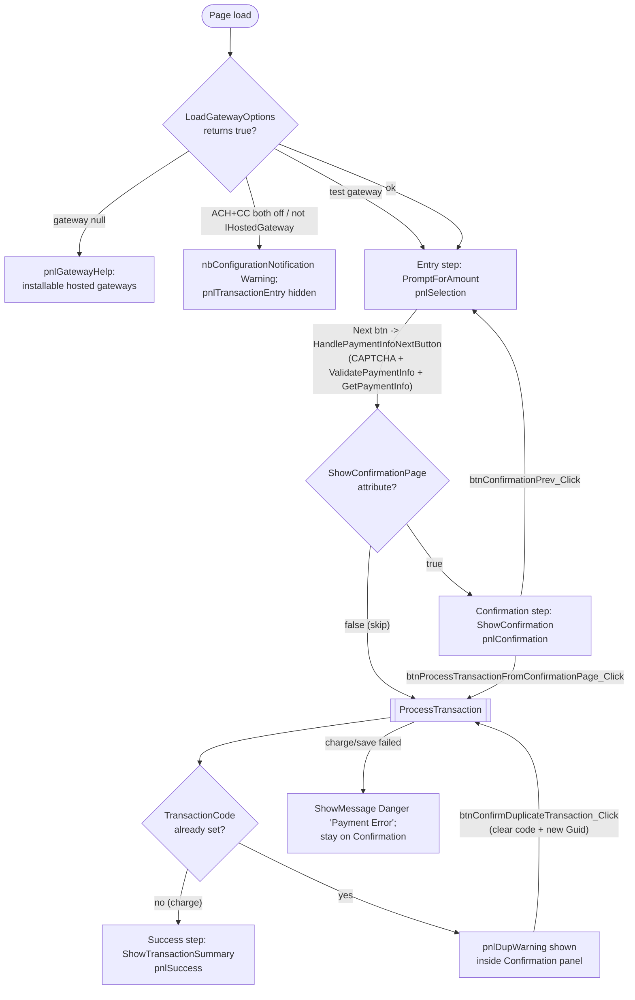

# UtilityPaymentEntry Legacy Flow Map

This is the authoritative parity reference for converting `RockWeb/Blocks/Finance/UtilityPaymentEntry.ascx[.cs]` to an Obsidian block. It was generated 2026-06-26 from the legacy code; the legacy code is ground truth (not Figma, not memory). Every assertion below is backed by a line reference into the legacy files, and any uncertainty is marked explicitly.

## Source

| File | Lines |
|---|---|
| `RockWeb/Blocks/Finance/UtilityPaymentEntry.ascx.cs` | 4399 |
| `RockWeb/Blocks/Finance/UtilityPaymentEntry.ascx` | 411 |

The wizard is a three-step state machine (`EntryStep` enum, `UtilityPaymentEntry.ascx.cs:826-838`) rendered as three panels inside one `pnlTransactionEntry` container, plus separate config-message and gateway-help surfaces that replace the wizard entirely.

## High-level flow

Notes on the diagram:
- The hosted (non-saved-account) Next button does not post back directly; tokenization is requested from the hosted control and the real transition fires from `_hostedPaymentInfoControl_TokenReceived` calling `btnHostedPaymentInfoNext_Click` (`UtilityPaymentEntry.ascx.cs:1007-1011`).
- Browser back/forward can also move the step via `page_PageNavigate` reading history state (`UtilityPaymentEntry.ascx.cs:1696-1703`).

## States

| State | Legacy EntryStep / panel | What the giver sees | Line refs |
|---|---|---|---|
| Entry | `EntryStep.PromptForAmount` = 1 / `pnlSelection` (+ `pnlContributionInfo`) | Account/amount picker, optional frequency + start/end date, comment, name/business, address, email/phone, SMS opt-in, anonymous, saved-account radio list, hosted payment iframe, Next button | `.ascx.cs:833`, `.ascx.cs:4069-4070`; `.ascx:97`, `.ascx:105` |
| Confirmation | `EntryStep.ShowConfirmation` = 2 / `pnlConfirmation` | Read-only summary (name, phone, email, address, per-account amounts, total, payment method, masked account, when), confirmation header/footer Lava, Previous + Finish buttons; duplicate-warning alert appears here when applicable | `.ascx.cs:834`, `.ascx.cs:4075`; `.ascx:291`, `.ascx:326` |
| Success | `EntryStep.ShowTransactionSummary` = 3 / `pnlSuccess` | Finish Lava summary HTML, optional save-account / create-login sub-panel, success footer | `.ascx.cs:835`, `.ascx.cs:4076`; `.ascx:347` |
| Gateway help (not an EntryStep) | `pnlGatewayHelp` (replaces `pnlTransactionEntry`) | "Welcome to Rock's On-line Giving Experience" + repeater of installable hosted gateways with Configure / Learn More links | `.ascx.cs:1628-1654`; `.ascx:72-87` |
| Config error (not an EntryStep) | `nbConfigurationNotification` Warning; `pnlTransactionEntry` hidden | Warning notification (both currency types disabled, or unsupported non-hosted gateway) | `.ascx.cs:1599-1623`, `.ascx.cs:1670-1677`; `.ascx:69` |
| Test-gateway notice (non-fatal) | `nbConfigurationNotification` Warning; wizard still shown | Warning notification, then Entry step proceeds | `.ascx.cs:1613-1616` (the `else if` test-gateway branch in `LoadGatewayOptions`; the `ShowConfigurationMessage("Testing", ...)` call is line 1615). The separate `else { HideConfigurationMessage(); }` at `.ascx.cs:1617-1620` is the non-test path and is unrelated. |
| Duplicate warning (sub-state of Confirmation) | `pnlDupWarning` nested in `pnlConfirmation` | "Warning!" alert + a danger button to confirm submitting another charge | `.ascx.cs:3542-3547`, `.ascx.cs:1037`; `.ascx:326-333` |

`SetPage(EntryStep)` is the single active-panel mechanism: it sets `pnlSelection.Visible` and `pnlContributionInfo.Visible = (page == PromptForAmount)`, `pnlConfirmation.Visible = (page == ShowConfirmation)`, `pnlSuccess.Visible = (page == ShowTransactionSummary)`, toggles `lHistoryBackButton.Visible`, and writes `hfCurrentPage.Value = page.ConvertToString(false)` (`.ascx.cs:4067-4079`). `pnlContributionPayment` and the action bar are not toggled by `SetPage`; they are descendants of `pnlSelection` and follow its visibility implicitly (`.ascx:231`, `.ascx:270`).

## Transitions

| From -> To | Trigger (handler + line) | Guard / condition |
|---|---|---|
| (load) -> Entry | non-postback `OnLoad` (`.ascx.cs:1052-1088`): seeds `hfTransactionGuid` (`.ascx.cs:1054`), calls `SetControlOptions()` (`.ascx.cs:1064`), then `SetPage(EntryStep.PromptForAmount)` (`.ascx.cs:1077`), then `SetCampusContextFilters()` + `ConfigureCampusAccountAmountPicker()` (`.ascx.cs:1085-1087`) | Only on `!Page.IsPostBack`. `SetControlOptions` (`.ascx.cs:2312`) wires up all attribute-driven Entry-form visibility/labels (phone/SMS/email/anonymous/comment sections, give-as panel, Next-button text, scheduling visibility). If a transfer is in flight (`_scheduledTransactionToBeTransferred != null`) AND the transferred schedule's authorized-person `GivingId` differs from `_targetPerson.GivingId`, the load pre-selects Business: `tglGiveAsOption.Checked = false; SetGiveAsOptions(); ShowBusiness();` (`.ascx.cs:1066-1075`). If `nbInvalidPersonWarning.Visible`, `pnlSelection` is force-hidden so only the error shows (`.ascx.cs:1079-1083`). |
| (load) -> Gateway help / Config error | `LoadGatewayOptions()` returns false; `OnLoad` bails (`.ascx.cs:1040-1044`, body `.ascx.cs:1580-1623`) | Gateway null -> help; both ACH+CC off -> config warning; not `IHostedGatewayComponent` -> unsupported warning. Test gateway is non-fatal and proceeds. |
| Entry -> Confirmation | `btnSavedAccountPaymentInfoNext_Click` (`.ascx.cs:1773`) or `btnHostedPaymentInfoNext_Click` (`.ascx.cs:1783`) -> `HandlePaymentInfoNextButton` (`.ascx.cs:1791`) -> `SetPage(ShowConfirmation)` (`.ascx.cs:1839`) | CAPTCHA validated when visible (`.ascx.cs:1797`); `ValidatePaymentInfo` must pass; reached only when `ShowConfirmationPage` attribute is true (`.ascx.cs:1836`). |
| Entry -> Success (confirmation skipped) | `HandlePaymentInfoNextButton` calls `btnProcessTransactionFromConfirmationPage_Click(null, null)` directly (`.ascx.cs:1845`) | `ShowConfirmationPage` attribute is false (`.ascx.cs:1836-1846`). |
| Entry -> Confirmation (hosted token) | `_hostedPaymentInfoControl_TokenReceived` -> `btnHostedPaymentInfoNext_Click(sender, e)` (`.ascx.cs:1010`) | `e.IsValid` true; on invalid, `nbPaymentTokenError` is shown and the Next handler is not called (`.ascx.cs:994-1006`). |
| Confirmation -> Entry | `btnConfirmationPrev_Click` -> `SetPage(EntryStep.PromptForAmount)` (`.ascx.cs:1859-1863`) | `btnConfirmationPrev` starts `Visible=false` (`.ascx:338`) and is shown inside `ValidatePaymentInfo` at `.ascx.cs:3270`. |
| Confirmation -> Success | `btnProcessTransactionFromConfirmationPage_Click` -> `ProcessTransaction(out errorMessage)`; on true, `SetPage(ShowTransactionSummary)` + `pnlSuccess.Focus()` (`.ascx.cs:1870-1886`) | `ProcessTransaction` returns true. `ProcessTransaction` (and the `ShowSuccess` it calls) does not itself call `SetPage`; the transition lives in this handler. |
| Confirmation -> Confirmation (payment error) | same handler, `ProcessTransaction` false -> `ShowMessage(Danger, "Payment Error", errorMessage)` (`.ascx.cs:1884`) | Charge/save failed with a non-empty error message. |
| Confirmation -> Duplicate warning | `ProcessTransaction` else-branch sets `pnlDupWarning.Visible = true`, returns false with empty error (`.ascx.cs:3542-3547`) | `TransactionCode` already non-empty (a charge already succeeded this session). |
| Duplicate warning -> Success | `btnConfirmDuplicateTransaction_Click` clears `TransactionCode`, assigns a fresh `hfTransactionGuid`, re-runs `ProcessTransaction`, then `SetPage(ShowTransactionSummary)` (`.ascx.cs:1893-1909`) | User clicks the confirm-duplicate button (`.ascx.cs:1896-1897`). |
| Any -> Any (history) | `page_PageNavigate` reads `e.State["GivingDetail"]` -> `SetPage` (`.ascx.cs:1696-1703`) | Only when `PartialPostbacksAllowed`; PromptForAmount pushed at `.ascx.cs:1833`, ShowConfirmation pushed at `.ascx.cs:1876`. |
| Success -> Success (save account) | `lbSaveAccount_Click` (`.ascx.cs:1916`) -> `CreateSavedAccount` | Requires `TransactionCode`; optional login creation; stays on Success. |

## Entry conditions (page parameters)

`PageParameterKey` is defined at `UtilityPaymentEntry.ascx.cs:703-716`. Page-parameter values are PascalCase keys per Rock convention.

| Parameter | Effect on load | Line refs |
|---|---|---|
| `rckid` (constant `PersonActionIdentifier`, value `"rckid"`) | Resolved in `OnInit` via `SetTargetPerson` (`.ascx.cs:923`). When present, `_targetPerson = PersonService.GetByPersonActionIdentifier(personActionId, "transaction")`. NOT the impersonation token `rckipid`. Impersonation allowed when `EnableTextToGiveSetup` OR the `Impersonation` attribute is true. Invalid token -> "Invalid or Expired Person Token specified"; disallowed impersonation -> "Impersonation is not allowed on this block." | `.ascx.cs:710`, `.ascx.cs:2009-2051`, `.ascx.cs:923` |
| `CampusId` | `GetCampusId` reads it (`AsIntegerOrNull`); falls back to `person.GetCampus()?.Id`. Sets `caapPromptForAccountAmounts.CampusId` (`.ascx.cs:1190`). This is the picker campus, distinct from the campus-context account filter. | `.ascx.cs:715`, `.ascx.cs:1268-1282` |
| `AccountIds` | Parsed by `ParseAccountUrlOptions` -> `ParseAccountUrlOptionsParameter` (URL-decode, split `,`, each split `^` into id/amount/enabled). Only consumed when `AllowAccountOptionsInURL` is true. Replaces selectable account ids, applies preset/read-only amounts, optional invalid-account validation message. | `.ascx.cs:705`, `.ascx.cs:1443-1511`, `.ascx.cs:1214-1262` |
| `AccountGlCodes` | Same parser with `parseAsAccountGLCode=true`; resolves account id by GL code (active, date-valid, public when `OnlyPublicAccountsInURL`). Unmatched code yields AccountId 0 (a latent issue, see Open questions). | `.ascx.cs:706`, `.ascx.cs:1457-1505` |
| `AmountLimit` | NOT applied on load. Enforced at submit in `ValidatePaymentInfo`: the cap is on `caapPromptForAccountAmounts.AccountAmounts.Sum(a => a.Amount)` over ALL account amounts including null/zero (a nullable-decimal `Sum`), NOT the filtered `amountAccountIds` set (`HasValue && != 0`) computed at `.ascx.cs:3133-3135`. The total is the same either way, but the cap reads the unfiltered nullable sum at `.ascx.cs:3154`. Error "The maximum amount is limited to {0}" (`.ascx.cs:3156`). Also surfaced to header/footer Lava (`.ascx.cs:2294`). | `.ascx.cs:3151-3158`, `.ascx.cs:2294` |
| `Frequency` | Handled in `SetGatewayOptions` (`OnInit`), only when `AllowScheduled` is true and a gateway exists. Split on `^`; part[0] selects frequency; part[1] explicitly false hides the dropdown and shows a read-only frequency literal (`txtFrequency`). | `.ascx.cs:2053-2100`, `.ascx.cs:2084-2097` |
| `StartDate` | `SetGatewayOptions`, gated by `AllowScheduled`. Parsed via `AsDateTime`, clamped to not-before-Today. | `.ascx.cs:2075-2082` |
| `Transfer` + `ScheduledTransactionGuid` | When BOTH non-blank, `OnLoad` calls `InitializeTransfer(ScheduledTransactionGuid.AsGuidOrNull())` (`.ascx.cs:1046-1050`). Loads the scheduled transaction, authorizes it against the target person's giving ids (own GivingId + business GivingIds), and only then sets `_scheduledTransactionToBeTransferred`. Pre-selects frequency/start date on first load. Runs on every load (before the `IsPostBack` guard). | `.ascx.cs:1046-1050`, `.ascx.cs:3083-3114` |
| `Attribute_` (prefix) | NOT read on load. Applied at transaction save: for each transaction attribute whose key is in `AllowedTransactionAttributesFromURL`, if a param `Attribute_{key}` exists, its URL-decoded value is written. | `.ascx.cs:3720-3728` |
| `ParticipationMode` | Read only inside the transaction-entity merge-field block when the entity is a `GroupMember` (default 1, family vs individual fundraising goal/raised). Affects Lava merge fields only. | `.ascx.cs:2252`, `.ascx.cs:2263-2291` |

Block context (not a page parameter): `AccountCampusContext` attribute drives `SetCampusContextFilters` (`.ascx.cs:4276-4287`), which (mode 0 = exact campus match, mode 1 = match or null campus) filters selectable/URL/available accounts (`.ascx.cs:1166-1170`, `1219-1222`, `1321-1325`).

## Carried state -> proposed bag surface

"Proposed home" is a recommendation for the Obsidian port, not legacy behavior. OptionsBag = init/config; Bag = per-request entry state; action arg = passed on a specific action; derived = recomputed server-side each request.

| Legacy state (ViewState key / field) | Holds | Written / read | Proposed home |
|---|---|---|---|
| `hfCurrentPage` (hidden field, default "1") | Current `EntryStep` | Written by `SetPage` (`.ascx.cs:4078`); read by `ShowMessage` to route the notification (`.ascx.cs:4092`) | Bag (current step) |
| `hfTransactionGuid` (hidden field) | Idempotency Guid for the transaction | Minted at `.ascx.cs:1054` and `.ascx.cs:1897`; read at `.ascx.cs:2296-2298`, `.ascx.cs:3446`, `.ascx.cs:3800` | Bag (idempotency token); action arg into process |
| `TransactionCode` (ViewState, getter coalesces to "") | Gateway code of the completed transaction | Written `.ascx.cs:3645`, `.ascx.cs:3761`; reset `.ascx.cs:1896`; gates `ProcessTransaction` (`.ascx.cs:3444`), gates save-account (`.ascx.cs:1918`), used at `.ascx.cs:3947` | Bag (per-request; gates duplicate + save-account) |
| `ScheduleId` (ViewState, int?) | Id of created `FinancialScheduledTransaction` | Written `.ascx.cs:3644`; read `.ascx.cs:3945`, `.ascx.cs:3962` | Bag (per-request; one-time vs scheduled receipt branch) |
| `GroupLocationId` (ViewState, int?) | Resolved home (person) / work (business) address `GroupLocation` id | Set `.ascx.cs:2530`/`.ascx.cs:2590`; cleared `.ascx.cs:2578`/`.ascx.cs:2595`; re-fetched on save `.ascx.cs:2767-2770` | Bag (per-request; lets process re-attach the address to the family Group) |
| `DisplayPhone` (ViewState, no null guard) | Phone-section visibility, resolved | Init from attribute `.ascx.cs:2339`; forced false when phone unlisted `.ascx.cs:2504`; gates persistence/validation | Derived + Bag (resolved server-side; diverges from raw attribute) |
| `DisplaySmsOptIn` (ViewState, no null guard) | SMS opt-in visibility, resolved | `.ascx.cs:2340` = `SmsOptIn` attribute AND `DisplayPhone` | Derived + Bag (depends on runtime phone resolution) |
| `AvailableAccounts` (ViewState as `AvailableAccountsJSON`, `List<AccountItem>`) | Accounts still addable via the add-account dropdown | Serialized `.ascx.cs:1141`; restored `.ascx.cs:1152`; reset `.ascx.cs:1178`; mutated by `UpdateAvailableAccounts` | Bag (per-request pool; persist, do not recompute) |
| `ViewState["PersonId"]` (no property wrapper) | Resolved/created giver person id | Read `.ascx.cs:2633`; written `.ascx.cs:2701` | Bag (resolved giver PersonId; distinct from `_targetPerson`) |
| `hfHostPaymentInfoSubmitScript` (hidden field) | Gateway JS to trigger tokenization | Written `.ascx.cs:960` | OptionsBag / gateway-config action result (render-time gateway data) |
| `hfBusinessesLoaded` (hidden field) | Contact person id whose businesses are loaded (rebind guard) | Compared `.ascx.cs:2426`; set `.ascx.cs:2463` | Client-local (reproduce keyed-by-contactPersonId memoization) |
| `_targetPerson` (private field) | Impersonation/current target person | Resolved each request by `SetTargetPerson` (`.ascx.cs:2009-2050`) | Derived (server-side per request) |
| `_scheduledTransactionToBeTransferred` (private field) | Transfer source schedule | `InitializeTransfer` (`.ascx.cs:3106`); read on save `.ascx.cs:3637-3639` | Derived (server-side per request); transfer is an action arg |
| `_accountCampusContextFilter` / `_currentCampusContextId` (private fields, default -1) | Campus-context account filter | `SetCampusContextFilters` (`.ascx.cs:4278`, `.ascx.cs:4284`); read `.ascx.cs:1166` | Derived (server-side per request) |
| `FinancialGateway` / `FinancialGatewayComponent` / `_hostedPaymentInfoControl` (private fields) | Lazily resolved gateway config | Lazy-loaded from `FinancialGateway` attribute (`.ascx.cs:853-889`) | Derived / OptionsBag |
| `FluidLayout` / `PartialPostbacksAllowed` (computed) | Layout + partial-render flags | `.ascx.cs:739-745`, `.ascx.cs:811-817` | OptionsBag (FluidLayout); no Obsidian analog (PartialPostbacksAllowed) |
| Selected account amounts (NOT in this block's ViewState) | Per-account chosen amounts | Held by `caapPromptForAccountAmounts` control's own state; `SelectedAccountsJSON` key is dead | Bag (must become an explicit field; no picker control to hold it) |
| `SelectableAccountIds` (on the picker control) | Accumulated selectable account ids across add-account postbacks | Appended `.ascx.cs:1531-1536`; persisted by the control's ViewState | Bag (persist alongside AvailableAccounts; a single list diverges) |
| Dead keys: `CreditCardTypeValueId`, `HostPaymentInfoSubmitScript`, `CaptchaFailCount`, `SelectedAccountsJSON` | n/a | Never read/written via `ViewState[ViewStateKey.X]` | Do not carry into the bag |

## Transaction processing (the money path)

`ProcessTransaction(out errorMessage)` (`UtilityPaymentEntry.ascx.cs:3441-3548`). Reached from `btnProcessTransactionFromConfirmationPage_Click` (`.ascx.cs:1870`), or directly when `ShowConfirmationPage` is false (`.ascx.cs:1845`).

1. Create `rockContext = new RockContext()` (never disposed) (`.ascx.cs:3443`).
2. **Up-front duplicate guard:** the entire charge sequence runs only inside `if (string.IsNullOrWhiteSpace(TransactionCode))` (`.ascx.cs:3444`). If `TransactionCode` is already set, go to the else branch: set `pnlDupWarning.Visible = true`, `errorMessage = string.Empty`, return false (`.ascx.cs:3542-3547`). This is a session/ViewState guard, NOT a DB duplicate-gift query.
3. Read `transactionGuid = hfTransactionGuid.Value.AsGuid()` (`.ascx.cs:3446`); resolve `gateway` and `financialGateway`; null gateway -> "There was a problem creating the payment gateway information" (`.ascx.cs:3451-3455`).
4. Compute `givingAsBusiness = !enableTextToGiveSetup && EnableBusinessGiving && !tglGiveAsOption.Checked` (`.ascx.cs:3457-3458`).
5. `person = GetPerson(!givingAsBusiness)` (created only when NOT giving as a business) (`.ascx.cs:3461`).
6. If `person == null && givingAsBusiness`, `person = GetBusinessContact()` (`.ascx.cs:3464-3467`).
7. Hard stops: `person == null` -> "There was a problem creating the person information" (`.ascx.cs:3469-3473`); `!person.PrimaryAliasId.HasValue` -> "There was a problem creating the person's primary alias" (`.ascx.cs:3475-3479`).
8. `businessOrPerson = GetPersonOrBusiness(person)` (`.ascx.cs:3481`). This is the value passed to `GetTxnPaymentInfo` and both Save methods; for business gifts it is the BUSINESS, so the business becomes the authorized giver.
9. `paymentInfo = GetTxnPaymentInfo(businessOrPerson, givingAsBusiness, out errorMessage)`; null -> return false (`.ascx.cs:3483-3487`). Inside `GetTxnPaymentInfo` (`.ascx.cs:3550`): builds the `ReferencePaymentInfo` via `GetPaymentInfo`, sets `BusinessName`/`FirstName`/`LastName`, tokenizes via `UpdatePaymentInfoFromPaymentControl` + `CreateCustomerAccount` only when `GatewayPersonIdentifier` is blank (`.ascx.cs:3575`), then `SetPaymentComment` (`.ascx.cs:3594`). Quirk: on `CreateCustomerAccount` error/empty token it shows a Danger message but does NOT return null; a blank token flows forward (`.ascx.cs:3586-3591`).
10. `schedule = GetSchedule()` (`.ascx.cs:3489`). Returns null unless `AllowScheduled` (`.ascx.cs:3397`); null also for an immediate one-time gift (one-time frequency AND start date <= today) (`.ascx.cs:3402-3406`); otherwise a `PaymentSchedule` with frequency/start/optional end (`.ascx.cs:3408-3427`).
11. **Scheduled branch** (`schedule != null`, `.ascx.cs:3491-3514`):
    1. `schedule.PersonId = person.Id` (always the contact/personal person) (`.ascx.cs:3493`).
    2. Existence check by Guid (`Queryable().FirstOrDefault(a => a.Guid == transactionGuid)`); if found -> `ShowSuccess(...)` + return true without charging (`.ascx.cs:3495-3501`).
    3. `gateway.AddScheduledPayment(financialGateway, schedule, paymentInfo, out errorMessage)`; null -> return false (`.ascx.cs:3503-3507`).
    4. `scheduledTransaction.Guid = transactionGuid` (`.ascx.cs:3510`).
    5. `SaveScheduledTransaction(financialGateway, gateway, businessOrPerson, paymentInfo, schedule, scheduledTransaction, rockContext)` (`.ascx.cs:3512`).
    6. `paymentDetail = scheduledTransaction.FinancialPaymentDetail.Clone(false)` (`.ascx.cs:3513`).
12. **One-time branch** (else, `.ascx.cs:3515-3536`):
    1. Existence check by Guid via `FinancialTransactionService.Queryable().FirstOrDefault(...)`; if found -> `ShowSuccess(...)` + return true without re-charging (`.ascx.cs:3517-3523`).
    2. `gateway.Charge(financialGateway, paymentInfo, out errorMessage)`; null -> return false (`.ascx.cs:3525-3529`).
    3. `transaction.Guid = transactionGuid` (`.ascx.cs:3532`).
    4. `SaveTransaction(financialGateway, gateway, businessOrPerson, paymentInfo, transaction, rockContext)` (`.ascx.cs:3534`).
    5. `paymentDetail = transaction.FinancialPaymentDetail.Clone(false)` (`.ascx.cs:3535`).
13. After either branch: `ShowSuccess(gateway, person, paymentInfo, givingAsBusiness)` (passed the real `person`, not `businessOrPerson`) (`.ascx.cs:3538`); return true (`.ascx.cs:3540`).

`SaveScheduledTransaction` (`.ascx.cs:3600-3647`): sets frequency/start/end, `AuthorizedPersonAliasId = person.PrimaryAliasId.Value` (here `person` is the `businessOrPerson` argument), gateway id, transaction type, `SetFromPaymentInfo`, source, `PopulateTransactionDetails`, `Summary = paymentInfo.Comment1`; `Add` + `SaveChanges`; if transfer, `DeleteOldTransaction(_scheduledTransactionToBeTransferred.Id)` + second `SaveChanges`; sets `ScheduleId` and `TransactionCode`; publishes `ScheduledGiftWasModifiedMessage`. No batch, no receipt, no `SaveAttributeValues`.

`SaveTransaction` (`.ascx.cs:3677-3761`): sets `AuthorizedPersonAliasId`, `ShowAsAnonymous = cbGiveAnonymously.Checked`, `TransactionDateTime = RockDateTime.Now`, gateway id, transaction type, `Summary`, `SetFromPaymentInfo`, source, `PopulateTransactionDetails`; batch via `GetForNewTransaction` + `EvaluateNewBatchHistory`; loads + writes allowed URL attributes; saves batch if new; `Add` + `SaveChanges`; `SaveAttributeValues`; `IncrementControlAmount`; publishes `GiftWasGivenMessage`; `HistoryService.SaveChanges` for the batch; `SendReceipt(transaction.Id)`; sets `TransactionCode`.

`DeleteOldTransaction` (`.ascx.cs:3650-3672`): own `RockContext` in a `using`; `Cancel` the transferred schedule, then `GetStatus` in a swallowing try/catch, then `SaveChanges`. New schedule is created first, then the old one cancelled.

`ShowSuccess` (`.ascx.cs:3793-3906`): opens its OWN new `RockContext` (`.ascx.cs:3802`), re-fetches the transaction by Guid (`Service.Get(transactionGuid)`, `.ascx.cs:3807`) or the scheduled transaction by Guid (`.ascx.cs:3820`), builds merge fields, resolves `FinishLavaTemplate` into `lTransactionSummaryHTML` (`.ascx.cs:3846`), then handles Text-to-Give vs save-account offer. It never calls `SetPage`.

## Must-preserve behaviors

### Campus / account mapping
The block delegates account/campus mapping to the `CampusAccountAmountPicker` control. `ConfigureCampusAccountAmountPicker` sets `caapPromptForAccountAmounts.CampusId = GetCampusId(_targetPerson)` (`.ascx.cs:1190`) and `UseAccountCampusMappingLogic` (`.ascx.cs:1191`); the returned `AccountId` is already the campus-specific child account. The block consumes that mapped id at `GetPaymentInfo` allocations (`.ascx.cs:3350`), `PopulateTransactionDetails` (`.ascx.cs:3780`), `SetConfirmationText` (`.ascx.cs:3315`), and `SetPaymentComment` (`.ascx.cs:4209`). There is no `GetMappedAccountForCampus` in the block; the mapping lives in the control.
- Parity note: do the campus-to-account mapping server-side (or in the Obsidian campus account amount picker), and persist the already-mapped account ids; never re-derive them downstream.

### Double-charge prevention
A single transaction Guid is minted on first non-postback load (`hfTransactionGuid.Value = Guid.NewGuid().ToString()`, `.ascx.cs:1054`), read in `ProcessTransaction` (`.ascx.cs:3446`), and checked against the DB by Guid before charging (`.ascx.cs:3495` scheduled, `.ascx.cs:3517` one-time), short-circuiting to `ShowSuccess` if already present. After the charge the same Guid is assigned to the new record (`.ascx.cs:3510`/`.ascx.cs:3532`). The visible duplicate warning is separate: it fires when `TransactionCode` is already set (`.ascx.cs:3542-3544`), and `btnConfirmDuplicateTransaction_Click` clears `TransactionCode` and mints a fresh Guid (`.ascx.cs:1896-1897`).
- Parity note: carry the idempotency Guid in the bag, run the DB existence check inside the process action, and keep the "already charged this session" warning as a separate session-state flag.

### Text-to-Give as a mode
`EnableTextToGiveSetup` (attribute key at `.ascx.cs:619`) is a mode that: forces impersonation (`.ascx.cs:2011-2012`), hides scheduling (`divRepeatingPayments.Visible`, `.ascx.cs:2333`), disables business giving (`givingAsBusiness` term, `.ascx.cs:3458`; `phGiveAsOption.Visible = false`, `.ascx.cs:2365-2372`), relabels the Next button to "Give" (`.ascx.cs:2387-2390`), and routes success through `PersonService.ConfigureTextToGive(person.Id, textToGiveContributionAccountId, savedAccountId, out _)` (saved-account path, `.ascx.cs:3858`) or auto-builds a "Text-To-Give ..." saved account via `CreateSavedAccount(accountTitle, rockContext, true)` (`.ascx.cs:3887`). `textToGiveContributionAccountId` is the first transaction/scheduled detail's `AccountId` (`.ascx.cs:3812`/`.ascx.cs:3821`).
- Parity note: model Text-to-Give as a configuration mode that conditions UI visibility, button label, and the success-side `ConfigureTextToGive` call; the contribution account id is the resolved first-detail account, not the saved-account id.

### Never re-render the payment form / tokenize + CAPTCHA at submit
The hosted control is mounted once in `InitializeFinancialGatewayControls` (`.ascx.cs:943`, added to `phHostedPaymentControl` at `.ascx.cs:956-958`); the submit script is stored at `.ascx.cs:960`; `TokenReceived` is subscribed at `.ascx.cs:983`. Tokenization happens at submit via the token callback (`.ascx.cs:992`, calling Next at `.ascx.cs:1010`). CAPTCHA has no server-side token subscriber (comment block at `.ascx.cs:930-938`) and is validated server-side at submit (`cpCaptcha.Visible && !cpCaptcha.IsResponseValid()`, `.ascx.cs:1797`), resetting client state via a startup script rather than re-rendering. Both Next buttons funnel through `HandlePaymentInfoNextButton` so the saved-account path shares the CAPTCHA-at-submit gate.
- Parity note: render the hosted gateway iframe and CAPTCHA exactly once; tokenize and validate CAPTCHA on the submit action without remounting either control.

### Lava templates + merge fields
`ShowSuccess` builds a full merge-field set (common fields, `TransactionEntity`, `Transaction`, `Person`, `PaymentDetail`, `BillingLocation`) and resolves `FinishLavaTemplate` (`.ascx.cs:3795-3846`). The default finish template (`DefaultFinishLavaTemplate` const at `.ascx.cs:624`) iterates details and renders `Account.PublicName`, `Amount | Minus: FeeCoverageAmount`, person/billing fields, and `Transaction.TotalFeeCoverageAmount` (`.ascx.cs:651-655`). `ResolveHeaderFooterTemplates` (`.ascx.cs:2226`) resolves TransactionHeader/ConfirmationHeader/ConfirmationFooter/SuccessFooter with entity transactions totals, fundraising goal/raised for `GroupMember` entities, `AmountLimit`, and the transaction by Guid.
- Parity note: resolve all four header/footer templates plus the finish template server-side with the same merge-field set; the default finish template references `TotalFeeCoverageAmount` even though the block's money path adds no fee coverage.

Note on fee coverage: the only `FeeCoverage` references are in the default finish Lava (`.ascx.cs:651`, `653`, `655`). No code in `GetPaymentInfo`, `GetTxnPaymentInfo`, `SaveTransaction`, or `SaveScheduledTransaction` adds a fee-coverage amount; `paymentInfo.Amount` is purely the sum of picker amounts (`.ascx.cs:3349`). Do not introduce fee-coverage logic in the charge/save path.

## Accounts & campus resolution

- `ConfigureCampusAccountAmountPicker` (`.ascx.cs:1158`) runs once after `SetCampusContextFilters` on non-postback load (`.ascx.cs:1085-1087`). It reads `AccountsToDisplay` via `GetByGuids` (`.ascx.cs:1163-1164`), applies the campus-context filter (`.ascx.cs:1166-1170`), orders by `Account.Order` (`.ascx.cs:1172`), resets `AvailableAccounts` (`.ascx.cs:1178`), sets amount-entry mode per `EnableMultiAccount` (`.ascx.cs:1180-1188`), sets `CampusId`, `UseAccountCampusMappingLogic`, `AskForCampusIfKnown`, `IncludeInactiveCampuses`, `OrderBySelectableAccountsIndex`, included campus status/type ids (`.ascx.cs:1190-1211`), `AllowPrivateSelectableAccounts = !OnlyPublicAccountsInURL` (`.ascx.cs:1212`), URL options override (`.ascx.cs:1214-1253`), final `SelectableAccountIds` (`.ascx.cs:1255`), and `ConfigureAvailableAccounts` (`.ascx.cs:1257`).
- URL account options (`.ascx.cs:1443-1511`): only when `AllowAccountOptionsInURL` is true. `^`-delimited id/amount/enabled per account; GL codes resolved by an active/date-valid/public query. `InvalidAccountMessage` validation runs when the message is non-blank (`.ascx.cs:1225-1248`). `Enabled=false` -> `ReadOnly=true` on the amount (`.ascx.cs:1250`).
- Two distinct campus concepts that must not be conflated: (1) Campus CONTEXT (`_currentCampusContextId` from `RockPage.GetCurrentContext` + `_accountCampusContextFilter`) filters which accounts appear; (2) picker CAMPUS (`GetCampusId`: `CampusId` param or `person.GetCampus()`) drives the picker dropdown and account-campus mapping. Different sources, different purposes.
- `ConfigureAvailableAccounts` (`.ascx.cs:1288`) early-returns when there are no selectable ids (picker then shows all). `GetAvailableAccounts` (`.ascx.cs:1309`) queries active/public/in-date accounts not already selectable, applies the campus-context filter, chunks in 1000s, and (in hierarchy mode) computes leaf-only `HasChildren`/`Children`/`IsRootItem`.
- `DatabindAddAccountsButton` (`.ascx.cs:1377`) builds a btn-group dropdown literal; flat vs nested submenu per hierarchy. Each leaf is `javascript:__doPostBack('{upPayment.ClientID}','btnAddAccountLiteral={id}')` (`.ascx.cs:1411`, `1420`). The argument is parsed back in `OnLoad` (`.ascx.cs:1091-1093`) and routed to `UpdateAvailableAccounts(accountId)` (`.ascx.cs:1517`), which moves the account out of `AvailableAccounts` and appends it to the picker's `SelectableAccountIds` (`.ascx.cs:1531-1536`).
- Postback default branch: any postback that is NOT an add-account postback falls through the `else` at `.ascx.cs:1097-1100` to `UpdateAvailableAccounts(null)` (`.ascx.cs:1099`). This re-binds the add-account dropdown from the persisted `AvailableAccounts` pool on every postback, so the dropdown is rebuilt each render whether or not an account was just added.
- Parity note: the add-account postback channel becomes an explicit "add account" block action carrying the account id; persist BOTH the available pool and the accumulated selectable-id set in block state, and rebuild the dropdown from the persisted pool on every render. Resolve all GL codes in one query/context and decide explicitly how to treat unmatched codes (legacy leaks AccountId 0).

## Person, business, anonymous, saved accounts, Text-to-Give

- Target person: `SetTargetPerson` (`.ascx.cs:2009-2051`) resolves `_targetPerson` from `rckid` (`GetByPersonActionIdentifier(..., "transaction")`) or `CurrentPerson`. Latent NRE: `_targetPerson.GetCampus()` runs at `.ascx.cs:2021` before the null guard at `.ascx.cs:2026`.
- `givingAsBusiness` is recomputed identically in six places: `.ascx.cs:2410`, `2645`, `2912`, `3128`, `3278`, `3458` (`!enableTextToGiveSetup && EnableBusinessGiving && !tglGiveAsOption.Checked`). The toggle is `OnText="Person"`/`OffText="Business"` (`.ascx:154`): Checked = Person, Unchecked = Business.
- `GetPerson(bool create)` (`.ascx.cs:2625`): resolves person from `ViewState["PersonId"]` else `_targetPerson`; creates only when `create && !givingAsBusiness`; handles nameless-merge, dedupe via `FindPerson`, new-person creation, HOME phone update/create with mobile fallback + SMS opt-in, and address persistence via `AddNewGroupAddress`; writes `ViewState["PersonId"]`.
- `GetBusinessContact` (`.ascx.cs:2800`): anonymous-business contact dedupe/creation with WORK phone; called from `ProcessTransaction` when `person == null && givingAsBusiness`.
- `GetPersonOrBusiness(person)` (`.ascx.cs:2909`): returns person unchanged unless `givingAsBusiness`; resolves the business via `cblBusiness`, then by last-name match, else creates a BUSINESS-record-type person + `AddContactToBusiness`; sets WORK phone/address; returns the business.
- Authorized giver (resolved by the code, not open): `SaveTransaction` (`.ascx.cs:3534`) and `SaveScheduledTransaction` (`.ascx.cs:3512`) are passed `businessOrPerson`, so `AuthorizedPersonAliasId = person.PrimaryAliasId` (`.ascx.cs:3679`) is the BUSINESS alias for business gifts. But `schedule.PersonId = person.Id` (`.ascx.cs:3493`) is always the contact/personal person, so the schedule owner and the scheduled transaction's authorized person can diverge for business gifts. Preserve both assignments distinctly.
- Anonymous: `cbGiveAnonymously.Visible = EnableAnonymousGiving` (`.ascx.cs:2362`); `transaction.ShowAsAnonymous = cbGiveAnonymously.Checked` (`.ascx.cs:3680`).
- Saved accounts: `BindSavedAccounts` (`.ascx.cs:2106`) returns early if `_targetPerson` or gateway is null; queries non-system accounts for the person, filters by allowed currency types (CC needs `enableCreditCard && SupportsSavedAccount`; ACH needs `enableACH && SupportsSavedAccount`; Apple/Google gated only by `SupportsSavedAccount`), appends a "Use a different payment method" option with value 0. `rblSavedAccount_SelectedIndexChanged` toggles saved-account vs hosted entry (`.ascx.cs:2206-2219`). `GetReferenceInfo` (`.ascx.cs:3380`) returns `savedAccount.GetReferencePayment()`; can return null for a stale saved account, and `GetPaymentInfo` dereferences `paymentInfo` immediately at `.ascx.cs:3349` with no guard (latent NRE).
- Save-account on success: `lbSaveAccount_Click` (`.ascx.cs:1916`) validates `TransactionCode`, optional login (username uniqueness, password rules, confirm match), and account name before `CreateSavedAccount` (`.ascx.cs:3924`). `CreateSavedAccount` resolves the transaction by code (one-time, when `!ScheduleId.HasValue`) or by `ScheduleId` (scheduled), optionally creates a `UserLogin` + confirm-account email, builds a `FinancialPersonSavedAccount` (copying masked number, currency/card type, name on card, expiration month/year, billing location), and runs `ConfigureTextToGive` when `enableTextToGiveSetup`.
- Text-to-Give automatic flow (`ShowSuccess`, `.ascx.cs:3848-3897`): when `EnableTextToGiveSetup && TransactionCode` present, saved-account path calls `ConfigureTextToGive`; otherwise auto-builds a "Text-To-Give ..." title and calls `CreateSavedAccount(..., true)`. Non-TTG branch reveals the save-account UI when not business, not saved-account, has `TransactionCode`, and the gateway supports saved accounts, setting `phCreateLogin.Visible` based on whether the person has no `UserLogin`.

## Edge cases

- **No gateway configured:** `LoadGatewayOptions` returns false; `ShowGatewayHelp` shows `pnlGatewayHelp` (installable hosted gateways) and hides `pnlTransactionEntry` (`.ascx.cs:1580-1623`, `1628-1654`).
- **Misconfiguration:** both ACH and CC disabled -> Warning "Configuration"; gateway not `IHostedGatewayComponent` -> Warning "Unsupported Gateway"; both hide `pnlTransactionEntry` and return false (`.ascx.cs:1599-1623`). Test gateway -> non-fatal Warning "Testing", proceeds.
- **Possible duplicate:** `TransactionCode` already set -> `pnlDupWarning` shown inside the Confirmation panel; `btnConfirmDuplicateTransaction_Click` clears the code and mints a new Guid before re-processing (`.ascx.cs:3542-3547`, `1893-1909`). `OnLoad` resets `pnlDupWarning.Visible = false` and `nbSaveAccount.Visible = false` every postback, alongside the notification-box resets at `.ascx.cs:1032-1038` (note: `nbConfirmationMessage` is reset twice and `nbSuccessMessage` is never reset).
- **CAPTCHA failure:** `HandlePaymentInfoNextButton` blocks at `.ascx.cs:1797` (`cpCaptcha.Visible && !cpCaptcha.IsResponseValid()`); client state is reset via a startup script, no re-render. Hosted token errors surface in `nbPaymentTokenError` (`.ascx.cs:994-1006`).
- **Validation failures:** `ValidatePaymentInfo` enforces amount limit (`.ascx.cs:3151-3158`), business name (`.ascx.cs:3208`), business-contact fields (`.ascx.cs:3231-3261`), address street1 (`.ascx.cs:3215`), phone when `DisplayPhone` (`.ascx.cs:3220`), email when `DisplayEmail` (`.ascx.cs:3225`), and first/last name + special-char/emoji rules when the name fields are visible (`.ascx.cs:3185-3206`). Failures keep the user on the Entry step with a notification.

## Implications for bags & action methods (for Monday)

All items here are recommendations for the Obsidian port, derived from the verified legacy behavior. Each is prefixed with "Proposed:".

Bags:
- Proposed: `UtilityPaymentEntryOptionsBag` (init/config) carries: gateway availability + `enableACH`/`enableCreditCard`, hosted gateway submit script + render token, `SupportsSavedAccount`, `EnableMultiAccount`, `EnableAccountHierarchy`, `AdditionalAccounts`, `AddAccountText`, `AllowScheduled` + `EnableEndDate`, frequency options (with a locked/read-only mode driven by the `Frequency` param), `EnableBusinessGiving`, `EnableAnonymousGiving` + tooltip, `EnableTextToGiveSetup`, `EnableCommentEntry`, `ShowConfirmationPage`, `FluidLayout`, `EnableInitialBackbutton`, the configured account picker config (campus context mode, selectable account ids, included campus status/type ids, `UseAccountCampusMappingLogic`, `AskForCampusIfKnown`), resolved `DisplayPhone`/`DisplaySmsOptIn`, SMS opt-in label, address/personal titles, configuration/gateway-help message state, and any invalid-person warning.
- Proposed: `UtilityPaymentEntryBag` (per-request entry state) carries: current `EntryStep`, idempotency Guid, `TransactionCode`, `ScheduleId`, resolved giver `PersonId`, `GroupLocationId`, selected per-account amounts, the accumulated selectable-account-id set, the addable `AvailableAccounts` pool, `givingAsBusiness`/Give-As toggle, selected saved-account id, name/business/contact fields, address, email/phone, SMS opt-in, anonymous flag, comment, frequency/start/end, and the resolved confirmation summary (name, phone, email, address, account rows, total, payment method, masked account, when).
- Proposed: process-transaction request bag carries the idempotency Guid, selected account amounts, billing/contact fields, frequency/schedule, comment, saved-account-vs-token choice (token or saved-account id), CAPTCHA token, and the transfer source guid; the response bag carries success/error, the resolved `TransactionCode`, `ScheduleId`, the rendered finish Lava HTML, and whether to show the save-account/create-login offer.

OptionsBag fields derived from settings + init:
- Proposed: resolve `DisplayPhone`/`DisplaySmsOptIn` server-side (they diverge from raw attributes when the phone is unlisted) and ship the resolved values.
- Proposed: resolve the gateway, hosted submit script, and `SupportsSavedAccount` server-side at init.
- Proposed: resolve campus context and picker campus separately; do not collapse them.

Block action method signatures (derived from the transitions):
- Proposed: `GetInitialState` / get-config (load) returns the OptionsBag + initial Bag, including gateway-help vs config-error vs wizard mode.
- Proposed: `AddAccount(accountId)` -> updates available pool + selectable ids, returns the refreshed Bag.
- Proposed: `SetGiveAsOption(isBusiness)` / `SelectBusiness(businessId)` -> refreshes person/business fields + business list.
- Proposed: `SelectSavedAccount(savedAccountId)` -> toggles saved-account vs hosted entry.
- Proposed: `ValidateAndConfirm(entryBag, captchaToken)` -> runs CAPTCHA + validation + builds confirmation; returns either the confirmation summary (when `ShowConfirmationPage`) or proceeds straight to process.
- Proposed: `ProcessTransaction(entryBag, idempotencyGuid)` -> the money path; returns the response bag (success/error, code, schedule id, finish HTML, save-account offer).
- Proposed: `ConfirmDuplicate(...)` -> clears `TransactionCode`, mints a new Guid, re-runs process.
- Proposed: `SaveAccount(accountName, login)` -> the success-step save-account action.

## Parity checklist

The **Obsidian status** column below is the original 2026-06-26 snapshot (all Pending); live parity status is tracked in the spec's Implementation Status and Remaining Work, not maintained here. Audit 2026-07-01 against the built block: of the 49 rows, 5 are built (add-account flat + hierarchy, `AvailableAccounts`/selectable-id persistence, frequency lock, dynamic start-date label), 9 are partial UI-only shells (hosted-token capture, comment field, picker campus, anonymous checkbox, the Text-to-Give scheduling gate, payment-form mount, transaction-header Lava, name entry, gateway-help/test-notice), 3 have no Obsidian analog (browser history, fee-coverage, notification-reset), and the remaining 32 are not started, including the entire submit / process / person / business / save / confirmation / success core. The block currently ships only `GetObsidianBlockInitialization`; there are no block actions and the per-request Bag is empty.

| Behavior / flow element | Legacy ref | Obsidian status |
|---|---|---|
| Three-step `EntryStep` state machine | `.ascx.cs:826-838`, `4067-4079` | Pending |
| Entry -> Confirmation (both Next buttons -> `HandlePaymentInfoNextButton`) | `.ascx.cs:1773-1852` | Pending |
| Confirmation skip when `ShowConfirmationPage` false | `.ascx.cs:1836-1846` | Pending |
| Hosted token callback drives Next | `.ascx.cs:992-1011` | Pending |
| Confirmation -> Entry (Previous) | `.ascx.cs:1859-1863` | Pending |
| Confirmation -> Success (process) | `.ascx.cs:1870-1886` | Pending |
| Browser history transitions | `.ascx.cs:1696-1703`, `1833`, `1876` | Pending |
| Up-front Guid duplicate guard (DB existence check) | `.ascx.cs:1054`, `3446`, `3495`, `3517` | Pending |
| Visible duplicate warning (session-state flag) | `.ascx.cs:3542-3547`, `1893-1909` | Pending |
| One-time charge path (`gateway.Charge` + `SaveTransaction`) | `.ascx.cs:3515-3536`, `3677-3761` | Pending |
| Scheduled path (`AddScheduledPayment` + `SaveScheduledTransaction`) | `.ascx.cs:3491-3514`, `3600-3647` | Pending |
| Transfer: new schedule then `DeleteOldTransaction` | `.ascx.cs:3637-3639`, `3650-3672` | Pending |
| `PopulateTransactionDetails` (`HasValue && != 0` vs sum `HasValue`) | `.ascx.cs:3769`, `3349` | Pending |
| Batch / attributes / history / receipt (one-time only) | `.ascx.cs:3713-3761` | Pending |
| `SendReceipt` one-time only | `.ascx.cs:3908`, `3759` | Pending |
| Comment composition (`SetPaymentComment`) | `.ascx.cs:4198-4231`, `3594` | Pending |
| No fee-coverage logic in money path | `.ascx.cs:3349`, `651-655` | Pending |
| Campus/account mapping via picker; mapped id consumed downstream | `.ascx.cs:1190-1191`, `3350`, `3780`, `3315`, `4209` | Pending |
| Campus CONTEXT vs picker CAMPUS kept distinct | `.ascx.cs:4276-4287`, `1268-1282` | Pending |
| URL account options + GL-code resolution + invalid-account message | `.ascx.cs:1443-1511`, `1214-1253` | Pending |
| Add-account dropdown + `UpdateAvailableAccounts` | `.ascx.cs:1377-1437`, `1517-1537` | Pending |
| `AvailableAccounts` + accumulated `SelectableAccountIds` persisted | `.ascx.cs:1141`, `1531-1536` | Pending |
| Hierarchy assembly (leaf-only children) | `.ascx.cs:1309-1371` | Pending |
| Target person / impersonation (`rckid`) | `.ascx.cs:2009-2051` | Pending |
| `givingAsBusiness` predicate (six sites) | `.ascx.cs:2410`, `2645`, `2912`, `3128`, `3278`, `3458` | Pending |
| Give-As toggle + business dropdown + contact placeholder | `.ascx.cs:2407-2470`, `1745-1763` | Pending |
| `GetPerson` create/dedupe/phone/address | `.ascx.cs:2625-2784` | Pending |
| `GetBusinessContact` (work phone) | `.ascx.cs:2800-2903` | Pending |
| `GetPersonOrBusiness` (business resolution + work address) | `.ascx.cs:2909-3057` | Pending |
| Authorized giver = business; `schedule.PersonId` = contact | `.ascx.cs:3512`, `3534`, `3679`, `3493` | Pending |
| Anonymous giving | `.ascx.cs:2362`, `3680` | Pending |
| Saved-account binding + currency filtering | `.ascx.cs:2106-2203` | Pending |
| Saved-account vs hosted toggle | `.ascx.cs:2206-2219` | Pending |
| `GetReferenceInfo` / `GetPaymentInfo` (saved vs new) | `.ascx.cs:3341-3389` | Pending |
| Save-account validation + `CreateSavedAccount` + login | `.ascx.cs:1916-1975`, `3924-4056` | Pending |
| Text-to-Give mode (impersonation, hide schedule, relabel, ConfigureTextToGive) | `.ascx.cs:619`, `2011`, `2333`, `2387`, `3854-3887` | Pending |
| Payment form mounted once; tokenize + CAPTCHA at submit | `.ascx.cs:943-983`, `992`, `1797` | Pending |
| Lava finish template + merge fields | `.ascx.cs:3793-3846`, `624`, `651-655` | Pending |
| Header/footer templates + fundraising goal/raised | `.ascx.cs:2226-2305` | Pending |
| `AmountLimit` submit-time enforcement | `.ascx.cs:3151-3158` | Pending |
| Nameless-person name entry vs read-only current name | `.ascx.cs:2351-2360`, `3282-3295` | Pending |
| Business-mode validation rules | `.ascx.cs:3208-3261` | Pending |
| Frequency locked/read-only mode (`^false`) | `.ascx.cs:2084-2097` | Pending |
| Dynamic start-date label ("When" / "First Gift" / "Next Gift" transfer) + end-date show/hide per `EnableEndDate` and One Time, recomputed every postback | `.ascx.cs:1103-1123` | Pending |
| Step-scoped notification boxes (`ShowMessage` routes by `hfCurrentPage`) | `.ascx.cs:4087-4109` | Pending |
| Per-postback notification reset asymmetry: `OnLoad` clears `nbMessage`, `nbSelectionMessage`, and `nbConfirmationMessage` (the latter set twice, a copy/paste duplicate at `.ascx.cs:1034-1035`), but does NOT clear `nbSuccessMessage`; the Obsidian port should decide this reset behavior intentionally | `.ascx.cs:1032-1038`, `4101-4102` | Pending |
| Gateway-help / config-error / test-gateway surfaces | `.ascx.cs:1580-1677` | Pending |
| `Attribute_`-prefixed transaction attributes (allow-listed) | `.ascx.cs:3720-3728` | Pending |
| Record-source / connection-status / record-status on new person | `.ascx.cs:3069-3072`, `2674-2690` | Pending |

## Open questions / ambiguities

These are latent issues in the legacy code and decisions the PO should weigh in on. None block the parity map; they are flagged so the Obsidian port can decide intentionally.

- Question for PO: `GetReferenceInfo` can return null for a stale/deleted saved account, and `GetPaymentInfo` dereferences `paymentInfo` immediately at `.ascx.cs:3349` (latent NRE). Should the Obsidian version handle a missing saved account gracefully?
- Question for PO: `ShowSuccess` re-fetches by Guid and would null-deref `financialScheduledTransaction` at `.ascx.cs:3823` if neither lookup finds a record. Preserve or guard?
- Question for PO: `SetTargetPerson` calls `_targetPerson.GetCampus()` at `.ascx.cs:2021` before the null guard at `.ascx.cs:2026`, so an invalid/expired token NREs before reaching the friendly message. Add a null check?
- Question for PO: `CreateCustomerAccount` partial-failure quirk (`.ascx.cs:3586-3591`): a blank/empty gateway token flows forward instead of stopping. Preserve or harden?
- Question for PO: GL-code URL lookup opens a new `RockContext` per option and yields AccountId 0 on no match (`.ascx.cs:1485-1500`); the Obsidian port should resolve GL codes in one query and decide how to treat unmatched codes.
- Question for PO: `DisplayPhone` can flip to false at runtime when the resolved phone is unlisted (`.ascx.cs:2504`), suppressing the phone section and skipping phone persistence. Is this implicit "unlisted hides the phone" side effect intended?
- Note: `PartialPostbacksAllowed` and the browser-history transitions have no direct Obsidian analog; the confirmation/back behavior should be modeled with client routing/state rather than ASP.NET history.
- Resolved (was an open question): selected account amounts are NOT tracked in this block's ViewState (`SelectedAccountsJSON` is dead); they live in the picker control and must become an explicit bag field in Obsidian.
